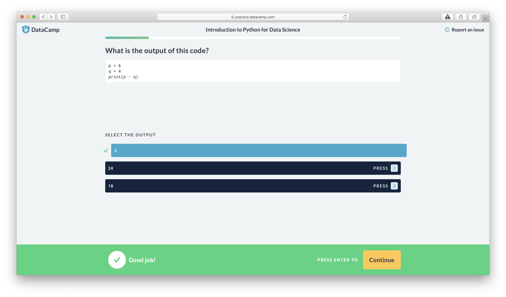

_This article is part of a short series in which DataCamp’s Practice & Mobile Team describe the process of porting a mobile application to the web. This first part covers the initial goals and motivation for the project. Stay tuned for parts 2 and 3 which go more in-depth on the technical aspects of the project._

Keen DataCampers may have noticed that we recently launched a new version of DataCamp Practice for Web. Beyond the slick new visual theme, many of the changes were technical improvements behind the scenes.

The technical improvements are designed to help us iterate and innovate more quickly and ultimately deliver more value to users. The most exciting part is that it’s actually a near-direct port of the practice mode that features in our own mobile app: DataCamp’s practice mode now shares the same codebase for both mobile and web!

## Are you mad?

Whilst DataCamp already had a practice mode for web, it was no longer actively being maintained and therefore not receiving the attention it deserved. Meanwhile, we developed and launched a new version of practice for [DataCamp for Mobile](https://www.datacamp.com/mobile), which focuses on learning on-the-go.

Practice is a core part (literally in the middle!) of DataCamp’s Learn -> Practice -> Apply approach to teaching data science. Recently, it became a strategic goal of the Mobile Team (now Practice & Mobile Team) to take ownership of Practice in general at DataCamp in order to drive innovation and bring further value to our users.

Now with 2 separate application to maintain, the question soon arose of how our team could easily add new features to both web and mobile without duplicating our efforts (and bugs!) across 2 distinct codebases.

With limited engineering capacity in our team (just 2 engineers), it soon became clear that maintaining a single codebase was the best solution to our problem and we soon set about dreaming up a strategy to turn this idea into a reality.

## Bringing a mobile app to the browser

At DataCamp we are heavily invested in the JavaScript ecosystem: many of our applications are written in JS for both the frontend and backend.

Our mobile app is no exception, we rely on many modern JS tools and technologies to build it. The backend is a NodeJS application which exposes an API via GraphQL and the frontend is the app itself which is written in React Native. Needless to say DataCamp are big React fans!

The legacy practice for web application was also written in JS, complete with its own backend. This posed a problem: our ideal solution would not involve maintaining 2 separate backends.

Our recently developed mobile backend is capable of serving up practice content, but this would involve re-writing the legacy app’s frontend to use the existing backend. This would leave us with 1 backend but 2 distinct frontends. Better, but not ideal! There are also significant differences in how each app interacts with its backend which would have presented some difficult technical challenges: the legacy app is ‘online first’ whereas the mobile app is ‘offline first’ and is designed to interact with its content offline.

Instead of maintaining 2 frontends, wouldn’t it be ideal if we could reuse our mobile frontend on the web in conjunction with our existing mobile backend? This would allow us to take advantage of all the existing code we have and also re-use the backend that was currently serving the mobile app. A large obstacle that stood in our way: how can we get the frontend code running in a browser?

We previously mentioned that our mobile app is written in React Native. This is a powerful technology that allows developers to write native mobile apps using JS. Due to being JS and React-based, the amount of resistance in reusing the code in a browser environment is lower than it might seem at first.

Fortunately, there are JS community efforts to bring React Native apps to the browser. One of the front-runners is [react-native-web](https://github.com/necolas/react-native-web): a port of React Native that allows you to target the DOM instead of mobile devices using the same code. In theory, this would allow us to reuse our existing codebase with minimal modification.

We set about working on a proof-of-concept and fell into a pit of success. We were able to get a super rough version of the mobile app in a browser running very quickly:

Whilst it was possible to get a proof-of-concept running quickly, the gulf between a scrappy proof-of-concept and a full-blown production app is quite large! Beyond the user interface, we had to reconsider several functional design aspects and also rework some of the underlying technical systems in order to optimise the user experience. The process of perfecting our port took a couple of months with 2 engineers and we learned a huge amount during this journey.

A separate article will explain some of the ins-and-outs of using react-native-web in production.

## Reflection and the future

Overall, we consider our port of mobile practice to web to have been a complete success. Our early user feedback and analytics demonstrate that it is performing at least as well as the previous web version which was our initial goal. From here on, we can now rapidly innovate on our codebase and bring innovation to web and mobile simultaneously.

We estimate that we were able to reuse 90% of our mobile components on the web and a similar amount of the business logic through our action creators, reducers and networking layer. In fact, the level of reuse was so high that early versions of the port had entire features of the mobile app accessible by the user, such as the dashboard and mobile Learn experience that we had no intention of bringing to the web.

The benefits of having a shared codebase go beyond basic code reuse. Part of the porting process involved adapting the user interface of practice to make better use of the horizontal screen space provided by modern widescreen desktops. This is quite a different aspect ratio to mobile phone screens which are optimised for vertical content and scrolling. However, tablets such as the iPad are much less focused on vertical content and so we also have the option in future of deciding which interface to use based on a device’s screen dimensions, rather than just on platform alone.

We look forward to bringing out new features and improvements for DataCamp practice for both mobile and web over the next weeks and months!

_Stay tuned for parts 2 and 3 which go more in-depth on the technical aspects of the project. ]Interested in working with DataCamp? [Check out our careers page!](https://www.datacamp.com/careers/)_
